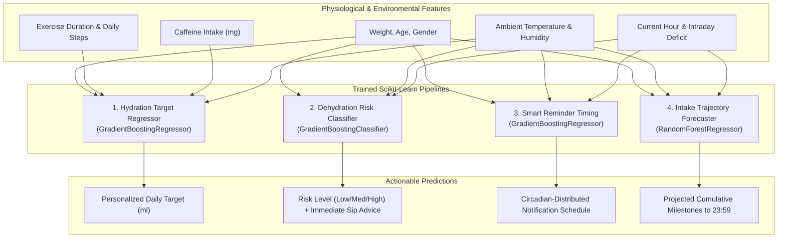

# 💧 WaterTrack Backend API

[](https://www.python.org/)
[](https://fastapi.tiangolo.com/)
[](https://www.sqlalchemy.org/)
[](https://scikit-learn.org/)
[](../LICENSE)

**WaterTrack** is an intelligent, production-ready hydration tracking and analytics backend API built with **FastAPI**, **SQLAlchemy 2.0**, and **scikit-learn**. It provides smart daily hydration recommendations, real-time dehydration risk assessment, circadian-aligned reminder scheduling, intake trajectory forecasting, GPS/weather-adjusted goals, streaks & analytics, and downloadable PDF reports.

---

## 📑 Table of Contents

- [Key Features](#-key-features)
- [Architecture & Tech Stack](#-architecture--tech-stack)
- [Project Structure](#-project-structure)
- [Getting Started](#-getting-started)
  - [Prerequisites](#prerequisites)
  - [Installation](#installation)
  - [Environment Configuration](#environment-configuration)
  - [Running the Application](#running-the-application)
- [Interactive API Documentation](#-interactive-api-documentation)
- [API Endpoints Overview](#-api-endpoints-overview)
  - [Authentication (`/auth`)](#authentication-auth)
  - [Users (`/users`)](#users-users)
  - [Water Logs (`/waterlogs`)](#water-logs-waterlogs)
  - [Goals & Recommendations (`/goals`, `/goal`)](#goals--recommendations-goals-goal)
  - [Reminder Settings (`/reminders`)](#reminder-settings-reminders)
  - [Analytics & Reports (`/stats`)](#analytics--reports-stats)
  - [Machine Learning & AI (`/ml`)](#machine-learning--ai-ml)
- [Machine Learning Models](#-machine-learning-models)
- [Running Tests](#-running-tests)
- [Docker & Containerization](#-docker--containerization)
- [Environment Variables](#-environment-variables)
- [License](#-license)

---

## ✨ Key Features

- 💧 **Hydration Logging & Presets**: Record water intake in milliliters with custom amounts or quick presets (`cup` = 250ml, `glass` = 350ml, `bottle` = 500ml, `large_bottle` = 750ml, `jug` = 1000ml).
- 🧠 **AI & Machine Learning Engine**:
  - **Hydration Target Regressor**: Predicts optimal daily water requirement ($R^2 \approx 0.99$) accounting for body metrics, physical activity, steps, caffeine intake, ambient temperature, humidity, and season.
  - **Dehydration Risk Classifier**: Multi-class risk detector (`low`, `moderate`, `high`) evaluating intraday intake deficit, hours since last drink, and thermal stress.
  - **Smart Reminder Optimizer**: Generates circadian-aligned reminder distribution across waking hours with nocturnal tapering.
  - **End-of-Day Intake Forecaster**: Forecasts cumulative milestone trajectory through 23:59.
- 🌤️ **Location & Weather-Adaptive Goals**: Automatically adjusts hydration requirements using live ambient temperatures fetched asynchronously from the Open-Meteo weather API.
- 📈 **Analytics & Streak Engine**:
  - Consecutive calendar day hydration streak tracking.
  - Daily totals, daily averages, and 24-hour temporal breakdown.
  - 7-day rolling hydration trends.
- 📄 **PDF Intake Reports**: Generates and streams downloadable, styled PDF summary reports via ReportLab.
- 🔔 **Custom Reminder Windows**: Configure notification intervals (15–480 minutes) and active time windows (`start_time` to `end_time`).
- 🔐 **Security & JWT Auth**: Secure authentication with Passlib (Bcrypt) password hashing, python-jose (HS256 JWT tokens), and strict Pydantic v2 schema validation.

---

## 🛠️ Architecture & Tech Stack

| Component | Technology | Description |
| :--- | :--- | :--- |
| **Web Framework** | [FastAPI](https://fastapi.tiangolo.com/) | High performance, async REST framework with automatic OpenAPI docs |
| **Database & ORM** | [SQLAlchemy 2.0](https://www.sqlalchemy.org/) | Type-safe ORM supporting SQLite (default) and PostgreSQL |
| **Data Validation** | [Pydantic v2](https://docs.pydantic.dev/) + `pydantic-settings` | Fast schema validation, serialization, and environment management |
| **Machine Learning** | [scikit-learn](https://scikit-learn.org/), [pandas](https://pandas.pydata.org/), [joblib](https://joblib.readthedocs.io/) | Pipelines with Gradient Boosting and Random Forest models |
| **PDF Generation** | [ReportLab](https://www.reportlab.com/) | Programmatic generation and streaming of PDF reports |
| **Authentication** | [python-jose](https://github.com/mpdavis/python-jose), [passlib](https://passlib.readthedocs.io/) | JWT bearer tokens & bcrypt password hashing |
| **External APIs** | [Open-Meteo](https://open-meteo.com/) via [HTTPX](https://www.python-httpx.org/) | Async temperature and weather fetching |
| **Database Migrations**| [Alembic](https://alembic.sqlalchemy.org/) | Managed schema migration engine |
| **Testing** | [Pytest](https://docs.pytest.org/), `pytest-httpx` | In-memory SQLite fixtures and async HTTP mocking |

---

## 📁 Project Structure

The project follows a clean, feature-driven modular structure:

```
watertrack/
├── app/
│   ├── api/
│   │   ├── deps.py                     # Dependency injection (get_current_user, get_db)
│   │   └── v1/
│   │       └── api.py                  # Consolidated v1 API router
│   ├── core/
│   │   ├── config.py                   # Pydantic Settings & environment loaders
│   │   ├── exceptions.py               # Centralized exception classes
│   │   ├── logging.py                  # Structured logging configuration
│   │   └── security.py                 # Password hashing & JWT generation
│   ├── db/
│   │   ├── base.py                     # SQLAlchemy DeclarativeBase
│   │   └── session.py                  # Engine and SessionLocal session factory
│   ├── features/                       # Modular feature slices
│   │   ├── analytics/                  # Stats calculation, streaks & PDF service
│   │   ├── auth/                       # User registration, login & JWT handling
│   │   ├── goals/                      # Static and weather-based recommendations
│   │   ├── ml/                         # ML models, dataset synthesis, training & inference
│   │   ├── reminders/                  # Reminder preferences and notification settings
│   │   ├── users/                      # User profile management
│   │   └── waterlogs/                  # Water intake CRUD & quick presets
│   ├── shared/                         # Cross-cutting utilities & helpers
│   └── main.py                         # FastAPI application factory & middleware setup
├── alembic/                            # Database migration environments
├── tests/                              # Comprehensive unit and integration tests
├── Dockerfile                          # Production container specification
├── docker-compose.yml                  # Multi-container orchestration
├── requirements.txt                    # Project dependencies
├── pyproject.toml                      # Tooling configuration & metadata
└── .env.example                        # Environment variables template
```

---

## 🚀 Getting Started

### Prerequisites

- **Python 3.10+** (Python 3.11 or 3.12 recommended)
- **pip** and **virtualenv** / `venv`
- **Docker** (optional, for containerized execution)

---

### Installation

1. **Clone the repository**:
   ```bash
   git clone https://github.com/pranavms04/Water_Tracker_App_Backend.git
   cd Water_Tracker_App_Backend
   ```

2. **Create and activate a virtual environment**:
   ```bash
   # macOS / Linux
   python3 -m venv venv
   source venv/bin/activate

   # Windows
   python -m venv venv
   .\venv\Scripts\activate
   ```

3. **Install dependencies**:
   ```bash
   pip install --upgrade pip
   pip install -r requirements.txt
   ```

---

### Environment Configuration

Copy the sample environment file and configure your local settings:

```bash
cp .env.example .env
```

Edit `.env` with your desired configuration:

```ini
# Application Settings
PROJECT_NAME="WaterTrack API"
VERSION="1.0.0"
API_V1_STR="/api/v1"

# Security (Generate a secure key using: openssl rand -hex 32)
SECRET_KEY="your-super-secret-jwt-key"
ALGORITHM="HS256"
ACCESS_TOKEN_EXPIRE_MINUTES=10080

# Database (SQLite by default; or PostgreSQL URI)
DATABASE_URL="sqlite:///./watertrack.db"

# CORS (Allowed origins, comma-separated or *)
CORS_ORIGINS="*"

# Weather Integration
OPEN_METEO_BASE_URL="https://api.open-meteo.com/v1/forecast"
OPEN_METEO_TIMEOUT_SECONDS=5.0
DEFAULT_ROOM_TEMP_CELSIUS=22.0
```

---

### Running the Application

Start the local development server with auto-reload:

```bash
uvicorn main:app --reload --host 0.0.0.0 --port 8000
```

The API will be live at `http://localhost:8000`.

---

## 📖 Interactive API Documentation

Once the server is running, explore and test the endpoints via the interactive Swagger and ReDoc documentation:

- **Swagger UI**: [http://localhost:8000/docs](http://localhost:8000/docs)
- **ReDoc**: [http://localhost:8000/redoc](http://localhost:8000/redoc)
- **OpenAPI JSON**: [http://localhost:8000/openapi.json](http://localhost:8000/openapi.json)

---

## 🔌 API Endpoints Overview

All routes are available both at the root path and under the `/api/v1` prefix (e.g. `/auth/login` and `/api/v1/auth/login`).

### Authentication (`/auth`)

| Method | Endpoint | Auth | Description |
| :--- | :--- | :--- | :--- |
| `POST` | `/auth/register` | No | Register a new user and initialize defaults |
| `POST` | `/auth/login` | No | Authenticate user credentials and return JWT |
| `GET` | `/auth/me` | Bearer | Get the authenticated user's profile |

### Users (`/users`)

| Method | Endpoint | Auth | Description |
| :--- | :--- | :--- | :--- |
| `GET` | `/users/{user_uuid}` | Bearer | Retrieve profile information by user UUID |
| `PUT` | `/users/{user_uuid}` | Bearer | Update user profile (name, weight, activity level) |

### Water Logs (`/waterlogs`)

| Method | Endpoint | Auth | Description |
| :--- | :--- | :--- | :--- |
| `GET` | `/waterlogs/today` | Bearer | Summary of today's intake vs daily goal |
| `POST` | `/waterlogs` | Bearer | Log a custom water intake amount (ml) |
| `POST` | `/waterlogs/quick` | Bearer | Log intake using preset (`cup`, `bottle`, etc.) |
| `GET` | `/waterlogs` | Bearer | List paginated logs with date range filters |
| `PUT` | `/waterlogs/{log_id}`| Bearer | Modify an existing intake log entry |
| `DELETE`| `/waterlogs/{log_id}`| Bearer | Remove a water log entry |

### Goals & Recommendations (`/goals`, `/goal`)

| Method | Endpoint | Auth | Description |
| :--- | :--- | :--- | :--- |
| `GET` | `/goal` | Bearer | Retrieve active daily and weekly goal |
| `PUT` | `/goal` | Bearer | Update target daily intake goal |
| `GET` | `/goals/recommendation` | Bearer | Baseline hydration recommendations by climate |
| `GET` | `/goals/recommendation-by-location` | Bearer | Weather-adjusted recommendations using GPS |

### Reminder Settings (`/reminders`)

| Method | Endpoint | Auth | Description |
| :--- | :--- | :--- | :--- |
| `GET` | `/reminders` | Bearer | Get user reminder configuration |
| `PUT` | `/reminders` | Bearer | Update reminder interval & active hours |

### Analytics & Reports (`/stats`)

| Method | Endpoint | Auth | Description |
| :--- | :--- | :--- | :--- |
| `GET` | `/stats` | Bearer | Comprehensive stats, streaks & hourly trends |
| `GET` | `/stats/weekly` | Bearer | 7-day water intake history |
| `GET` | `/stats/report/pdf` | Bearer | Stream/download styled PDF hydration report |

### Machine Learning & AI (`/ml`)

| Method | Endpoint | Auth | Description |
| :--- | :--- | :--- | :--- |
| `POST` | `/ml/predict/goal` | No | Predict optimal daily goal with feature breakdown |
| `POST` | `/ml/predict/risk` | No | Real-time dehydration risk assessment & sip advice |
| `POST` | `/ml/predict/reminders` | No | Generate circadian-aligned reminder schedule |
| `POST` | `/ml/predict/forecast` | No | Cumulative end-of-day intake trajectory forecast |
| `GET` | `/ml/recommendation/me` | Bearer | Personalized ML prediction for authenticated user |
| `POST` | `/ml/train` | No | Train/retrain all 4 models on synthetic data |
| `GET` | `/ml/status` | No | Check loaded ML models and pipeline status |
| `GET` | `/ml/metrics` | No | View $R^2$, MAE, accuracy, and feature rankings |

---

## 🤖 Machine Learning Models

WaterTrack includes 4 dedicated scikit-learn models pre-trained on physiological and metabolic guidelines:



To re-train all models at any time with custom sample sizes:
```bash
curl -X POST "http://localhost:8000/ml/train" \
     -H "Content-Type: application/json" \
     -d '{"n_samples": 5000}'
```

---

## 🧪 Running Tests

The test suite covers domain logic, authentication, CRUD operations, analytics, PDF streaming, weather integration, and ML predictions using an in-memory SQLite database.

```bash
# Run the complete test suite
pytest

# Run with verbose output and coverage
pytest -v

# Run a specific test module
pytest tests/test_ml.py -v
```

---

## 🐳 Docker & Containerization

### Run with Docker Compose

Build and start the containerized application:

```bash
docker-compose up --build -d
```

Check the container logs:

```bash
docker-compose logs -f
```

Stop the services:

```bash
docker-compose down
```

### Build and Run Docker Directly

```bash
# Build image
docker build -t watertrack-api .

# Run container
docker run -d -p 8000:8000 --name watertrack-api watertrack-api
```

---

## 🚀 Render Deployment

When deploying to [Render](https://render.com) as a Web Service:

1. **Build Command**:
   ```bash
   pip install --upgrade pip && pip install -r requirements.txt
   ```

2. **Start Command**:
   ```bash
   uvicorn main:app --host 0.0.0.0 --port $PORT
   ```
   *(or `gunicorn -k uvicorn.workers.UvicornWorker -b 0.0.0.0:$PORT main:app`)*

3. **Environment Variables**:
   Configure `SECRET_KEY`, `DATABASE_URL` (if using Render PostgreSQL), etc. in the Render Dashboard Environment tab.

---

## ⚙️ Environment Variables

| Variable | Type | Default | Description |
| :--- | :--- | :--- | :--- |
| `PROJECT_NAME` | string | `WaterTrack API` | Application display name |
| `VERSION` | string | `1.0.0` | API version string |
| `API_V1_STR` | string | `/api/v1` | Prefix for versioned endpoints |
| `SECRET_KEY` | string | *development-default* | Secret key for JWT signature encryption |
| `ALGORITHM` | string | `HS256` | JWT cryptographic algorithm |
| `ACCESS_TOKEN_EXPIRE_MINUTES` | int | `10080` (7 days) | JWT expiration time in minutes |
| `DATABASE_URL` | string | `sqlite:///./watertrack.db` | SQLAlchemy database connection URI |
| `CORS_ORIGINS` | string / list | `*` | Allowed CORS origins (comma-separated or `*`) |
| `OPEN_METEO_BASE_URL` | string | `https://api.open-meteo.com/v1/forecast` | Open-Meteo endpoint URL |
| `OPEN_METEO_TIMEOUT_SECONDS` | float | `5.0` | Timeout for external weather queries |
| `DEFAULT_ROOM_TEMP_CELSIUS` | float | `22.0` | Fallback temperature when weather API is offline |

---

## 📄 License

This project is licensed under the MIT License — see the [LICENSE](LICENSE) file for details.
